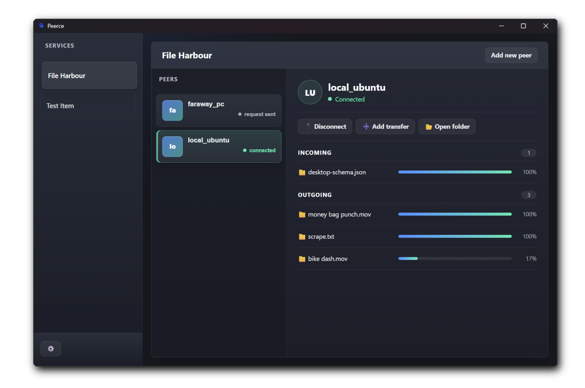

<p align="center">
  
</p>

# Peerce GUI

Peerce GUI is a desktop interface for connecting peers and transferring files with [Peerce](https://www.npmjs.com/package/peerce). It provides peer management, connection status, transfer progress, and persistent transfer history in a native Tauri application.

> [!WARNING]
> **Peerce GUI is currently in active development.** Features and configuration may change, some functionality is incomplete, and the application is not yet recommended for production use.

## Preview



## Technology

- Tauri 2 desktop shell
- React 19 and TypeScript
- Node.js HTTP and WebSocket backend
- Peerce peer-to-peer networking

## Development

Install the [Tauri prerequisites](https://v2.tauri.app/start/prerequisites/) for your platform, then run:

```bash
npm install
npm run dev
```

To start a local Peerce relay for development:

```bash
npm run peerce-relay-local
```

Create a production bundle with:

```bash
npm run build
```
